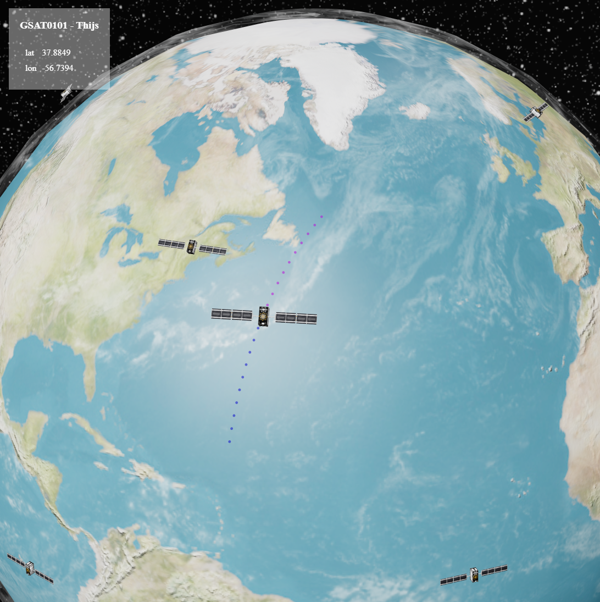

# Visualize Galileo satellites in orbit

Interactive virtual globe with Galileo satellites in orbit using [svelthree](https://svelthree.dev/).



## Project setup

```
npm install
```

### Compiles and hot-reloads for development

```
npm run dev
```
